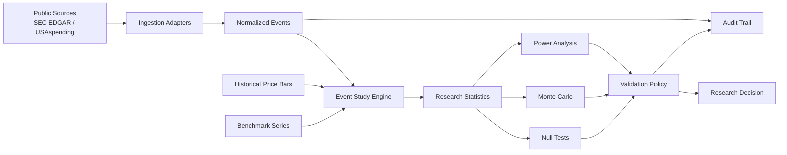

# AlphaWatch — Systematic Market Research & Validation Platform


AlphaWatch is a **research-first software project** for turning public corporate and government data into structured, testable market hypotheses.

This repository is the **portfolio edition** of a larger experimental research archive. It preserves the parts that best demonstrate the engineering and research methodology while intentionally excluding generated state, private/local configuration, historical clutter, broker-facing experiments, and internal operator files.

> **No live trading. No managed money. No performance claims.**  
> The project is designed to test and falsify hypotheses using paper-only and historical workflows.

## Why this project exists

The goal is not to manufacture a profitable backtest. The goal is to build a system that can answer a harder question:

**Does a proposed market hypothesis survive data-quality checks, null tests, transaction-cost assumptions, robustness tests, and out-of-sample validation?**

AlphaWatch treats a null result as useful evidence rather than a failure to hide.

## What it demonstrates

- **Python research systems** with typed domain models and testable pure functions
- **Public-data ingestion adapters** for SEC EDGAR and USAspending
- **Event-study analysis** with benchmark-adjusted returns
- **Null testing** through deterministic sign-flip/permutation simulations
- **Monte Carlo analysis** for path-level risk exploration
- **Power calculations** for minimum sample-size planning
- **Validation policy** that separates descriptive findings from stronger research states
- **Auditability** through append-only structured research records
- **Safety boundaries** that explicitly reject live execution in this portfolio edition
- **FastAPI** health/research endpoints for a small local service surface
- **pytest** coverage and GitHub Actions CI

## Architecture



The key separation is deliberate:

```text
public data -> research evidence -> validation decision

research evidence != trade instruction
```

## Research workflow

1. Define the hypothesis **before** reading the result.
2. Define the observation point, benchmark, horizon, expected direction, and minimum sample size.
3. Ingest and normalize public events.
4. Join events to historical price bars.
5. Measure raw and benchmark-adjusted forward returns.
6. Run statistical summaries and null tests.
7. Stress results with transaction-cost and robustness assumptions.
8. Assign a conservative research state.
9. Preserve unsuccessful experiments instead of deleting them.

The detailed methodology is in [docs/RESEARCH_METHODOLOGY.md](docs/RESEARCH_METHODOLOGY.md).

## Repository layout

```text
.
├── src/alphawatch_research/
│   ├── ingestion/          # SEC EDGAR and USAspending adapters
│   ├── research/           # event studies, null tests, Monte Carlo, power
│   ├── api.py              # small local FastAPI surface
│   ├── audit.py            # append-only JSONL research trail
│   ├── models.py           # typed domain models
│   ├── safety.py           # paper-only guardrails
│   └── validation.py       # conservative decision ladder
├── tests/                  # representative unit tests
├── examples/demo.py        # deterministic end-to-end example
└── docs/                   # architecture, methodology, limitations
```

## Quick start

Requires **Python 3.11+**.

```bash
python -m venv .venv
# Windows
.venv\Scripts\activate
# macOS/Linux
# source .venv/bin/activate

python -m pip install -e ".[dev]"
pytest
python examples/demo.py
```

Run the local API:

```bash
uvicorn alphawatch_research.api:app --host 127.0.0.1 --port 8000
```

Then open:

```text
http://127.0.0.1:8000/health
```

## Example research decision ladder

AlphaWatch uses intentionally conservative labels:

```text
NOT_ENOUGH_DATA
DESCRIPTIVE_ONLY
HISTORICAL_CANDIDATE
NEEDS_FORWARD_CONFIRM
CONFIRMED
REJECTED
```

A strong historical result does **not** automatically become a trading claim.

## Data sources

The ingestion examples support public endpoints from:

- **SEC EDGAR** — recent company filing metadata
- **USAspending.gov** — U.S. federal award search

Users remain responsible for source terms, rate limits, user-agent requirements, point-in-time correctness, identifier mapping, and data licensing.

## What is deliberately excluded

This portfolio edition does not include:

- live brokerage connectivity
- order-routing code
- real-money execution
- credentials or API keys
- local databases or generated reports
- private research state
- historical phase-by-phase development clutter
- claims of proven alpha

See [docs/SAFETY_AND_LIMITATIONS.md](docs/SAFETY_AND_LIMITATIONS.md).

## Relationship to the original AlphaWatch archive

The original project grew through many research phases and included broader local tooling, dashboards, paper portfolios, validation infrastructure, and operational experiments. This repository is a deliberately smaller **engineering portfolio version**: the core ideas are preserved, but the code is reorganized to be easier to inspect, test, and discuss in an interview.

## Tech stack

- Python 3.11+
- FastAPI
- httpx
- Pydantic
- pytest
- GitHub Actions

The broader AlphaWatch archive also explored SQLAlchemy/Alembic persistence, Streamlit, React/TypeScript interfaces, desktop operator tooling, and additional research modules. Those components are not required to understand this portfolio edition.

## Disclaimer

This repository is for software-engineering and research demonstration only. It is not investment advice, does not provide trading recommendations, and does not claim a profitable or production-ready trading strategy.

## License

MIT — see [LICENSE](LICENSE).
