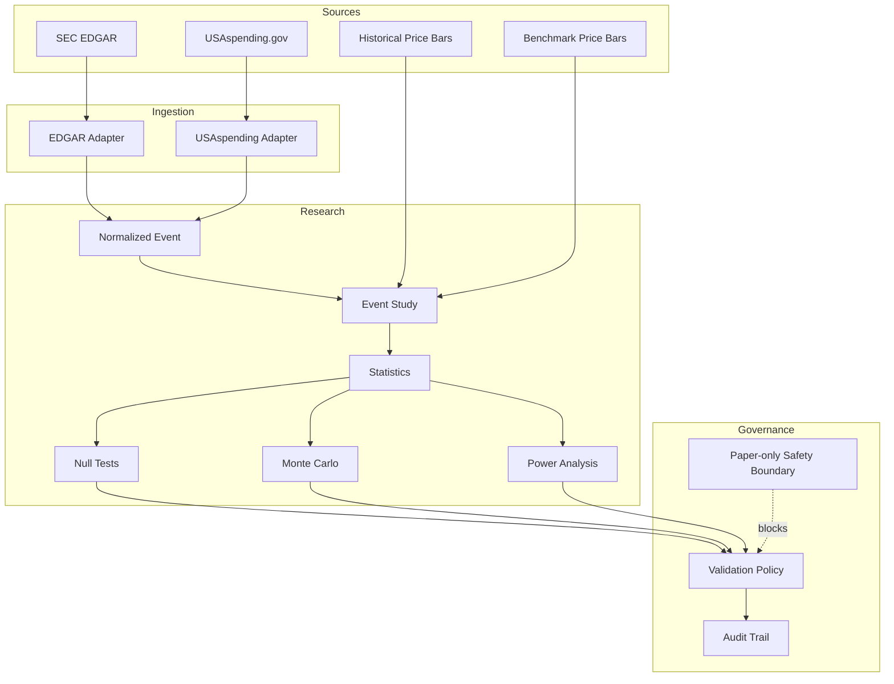

# Architecture

AlphaWatch is organized around a simple principle: **research evidence should be easy to inspect and difficult to confuse with execution authority**.

## System boundaries

## Design choices

### Pure research functions first

Core calculations are implemented as pure functions where possible. This makes them easier to test and prevents hidden state from changing a result.

### Public-source adapters are narrow

The SEC and USAspending modules build requests and normalize only the fields needed for research. They do not own research decisions.

### Validation is explicit

Research states are represented by an enum rather than optimistic prose. The policy can reject or downgrade a result when sample size, null-test quality, cost sensitivity, or forward confirmation is insufficient.

### Audit records are append-only

The JSONL audit helper writes one structured record per event. A real deployment would normally back this with durable database storage, but JSONL keeps the portfolio edition transparent.

### Live execution does not exist here

The package contains a hard paper-only guard and no broker/order adapter. That is a deliberate architectural omission, not an unfinished TODO.
